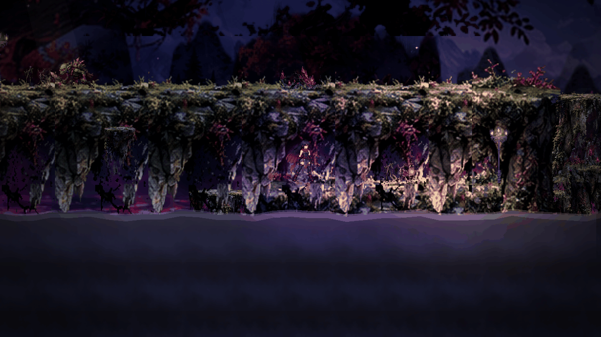
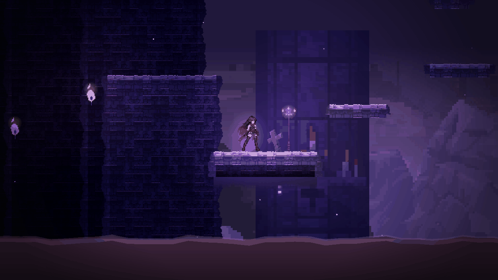

# Região II — playtest human-like por bot + auditoria de fidelidade à arte aprovada

**Processo:** Region II Human-Like Bot Playtest + Approved Art Fidelity Audit
**Data:** 18 set 2026
**Base:** `claude/region02-completion-pass` @ `53f4d4483f5231ac6ec467f51e61f63784cda323`
**Branch:** `claude/region02-humanlike-bot-playtest`
**Alterações a jogo:** **nenhuma.** Nem cenas, nem chefes, nem assets, nem
balanceamento, nem física, nem correcção de bugs. Isto é observação, prova e
crítica.

O termo de comparação visual são os **ficheiros aprovados** de
`docs/art_direction/regions/region_02/`, inventariados em
[`region_02_visual_evidence/REFERENCE_MAP.md`](region_02_visual_evidence/REFERENCE_MAP.md).
A pergunta não é "está bonito?" — é **quanto é que o jogo real se afasta dos
ficheiros que já foram aprovados**. Qualidade artística e fidelidade ao cânone
são duas avaliações diferentes, e este documento só faz a segunda (a primeira
aparece apenas onde é preciso para ser justo).

---

## 0. Como isto foi medido (e o que a medição não prova)

**Ambiente.** Godot 4.7.2 headless para as runs (`--fixed-fps 60`, ~16x tempo
real) e Godot 4.7.2 + Xvfb/llvmpipe (OpenGL3) a 1280x720 para as fotografias.
O `user://` de cada run vai para um sandbox próprio: o bot morre centenas de
vezes e **cada morte grava**.

**Bot** (`tools/bot_humano_r2.gd`). Piloto externo: carrega o nível e carrega
nas mesmas acções que um telemóvel carrega. Não toca em física, vida, dano ou
save. Navega por um grafo das superfícies do nível (Dijkstra com custo por
risco de salto), e sabe que as correntes ascendentes, o planar contextual e a
rajada a favor mudam o que é alcançável.

**Limites honestos do bot — ler antes de usar os números:**

1. **Não bate nenhum dos cinco chefes.** Os chefes da região têm 1000-2000 de
   vida efectiva (multiplicador de dificuldade x3,2-x3,7) e só aceitam dano na
   janela EXPOSTO. Nenhuma das 54 runs terminou um nível com chefe. Os números
   de chefe são "até onde chegou", não "como correu a luta toda".
2. **O N10 é o pior caso do bot.** É um poço vertical com saltos de 130-150 px
   e ácido instantâneo por baixo; o bot completa ~70% da subida mas raramente
   entra na arena. Os números de combate do N10 valem pouco; os de **traversal**
   valem muito (ver §4.6).
3. **Comparar perfis entre si exige normalizar.** Um perfil que hesita mais
   avança menos e morre menos. Por isso a tabela traz **progresso %** e
   **mortes por 1000 px andados**, e não só mortes.
4. O bot não procura segredos nem rotas alternativas de propósito — o que
   encontra, encontra por erro. "Segredos" não foram avaliados.

**Fotografia.** `tools/shot_r2.gd`, que põe a Koliani num X/Y pedido ou espera
por uma FASE nomeada da máquina de estados do chefe. As 45 fotografias estão em
[`region_02_visual_evidence/`](region_02_visual_evidence/), uma pasta por nível.

---

## 1. Inventário aprovado (Fase 0)

Oito pranchas, 1536x1024 cada, todas lidas:
`concept_environment_01/02`, `level_mechanics_and_layout`,
`asset_atlas_tileset`, `asset_atlas_level_assets`, `enemy_gameplay_pack`,
`boss_pack`, `implementation_sheet`. Mais `KOLIANI_REGION_CANON.md`,
`REGIONS_INDEX.md`, `region_02/README.md` e
`GUARDIAO_DOS_CEUS_VISUAL_CONTRACT.md`.

**Não falta nenhuma referência para a Região II.** O N05 não tem referência
nesta pasta por ser da Região I — é por isso que serve de **controlo**.

O mapa completo (LOCKED vs INTERPRETATION FLEX, prancha a prancha) está em
[`REFERENCE_MAP.md`](region_02_visual_evidence/REFERENCE_MAP.md). O resumo
operacional:

| Eixo | O que a arte aprovada manda |
|---|---|
| Leitura | falésias abertas + ruínas góticas **sobre um mar de nuvens**, lua de sangue, mundo partido e ALTO |
| Terreno | pedra em blocos **com vinhas e folhagem carmesim a cair das bordas**; variações normal / vegetação / destruído / cristais / gelo |
| Arquitectura | arcos góticos, janelas ogivais com vitral, colunas em ruínas, pontes, torres partidas, plataformas suspensas por correntes |
| Props | estátuas, **gárgulas**, **bandeiras carmesim com cruz**, correntes, lanternas, **braseiros**, urnas, cercas, escombros, **cristais violeta**, **vegetação carmesim**, árvores secas |
| Parallax | 4-5 camadas: silhuetas → montanhas/ruínas → **castelos e ilhas flutuantes** → nuvens e vento → detalhes próximos |
| FX | rajadas, colunas ascendentes, turbilhões, folhas/detritos carmesim, poeira, névoa baixa, raios distantes, aurora |
| Bestiário | 10 criaturas, **todas voadoras, levitantes ou feitas de vento** |
| Chefe | corvídeo colossal, asas abertas como elemento mais largo, olho = núcleo violeta, pontas de pena carmesim, bico e garras de ouro |

---

## 2. O veredicto curto

O utilizador acha que a arte e os chefes não ficaram suficientemente parecidos
com os ficheiros aprovados. **Comparados os ficheiros: tem razão na maior
parte, e não tem razão em duas coisas.**

**Onde tem razão (afastamentos grandes, verificáveis):**

1. **O bestiário da região não existe no jogo.** A prancha aprovada tem dez
   criaturas — `MORCEGO DOS VENTOS`, `SENTINELA FLUTUANTE`, `GAIVOTA SOMBRIA`,
   `GOLEM AÉREO`, `MAGO DO VENTO`, `SERPENTE EÓLICA`, `ESPECTRO DAS RUÍNAS`,
   `ARQUEIRO EÓLICO`, `TORRE VIGIA`, `ELEMENTAL DO VENTO` — e **todas voam,
   levitam ou são feitas de vento**. Censo medido no nível já construído
   (`tools/recon_r2.gd`, uma amostra por nível):

   | | inimigos encontrados | canónicos |
   |---|---|---:|
   | N06 | esqueleto 3 · chort 2 · imp 2 · orc 2 · mastim 1 · goblin 1 | **0/10** |
   | N07 | imp 9 · mastim 2 · chort 1 · esqueleto 1 · goblin 1 | **0/10** |
   | N08 | chort 1 · goblin 1 | **0/10** |
   | N09 | mastim 5 · orc 3 · chort 2 · esqueleto 2 · goblin 1 | **0/10** |
   | N10 | orc 1 · goblin 1 | **0/10** |

   São cães, esqueletos, brutos e demónios terrestres — e `goblin`, que é a
   assinatura da Região I. A tabela `ESP_REGIAO[1]` de
   `scripts/gerador_corredor.gd` ainda está comentada `# II Prisão` e lista
   `esqueleto, chort, orc, imp, mastim`. **O jogo já tem duas espécies
   voadoras com arte completa** — `abutre` e `olho`, ambas em
   `ESPECIES_VOAM` de `scripts/demonio_base.gd` — e a Região II não usa
   nenhuma.
2. **O terreno não tem a vegetação que define a região.** O catálogo de
   decoração (`assets/sprites/pixel/deco/deco.json`) dá 12 props ao
   `desfiladeiro`, dos quais **três** assentam no chão — e dois desses
   (`cruz`, `lapide`) são vocabulário de cemitério que não aparece em
   nenhuma prancha da Região II. A Região I tem 17 props e 8 de chão. Nenhum
   dos props aprovados mais identitários (estátua, gárgula, cristal,
   vegetação carmesim, braseiro, urna, arco) existe.
3. **O mar de nuvens está no jogo e está escuro demais para se ler como
   nuvens.** Esta é a descoberta mais accionável do audit e é preciso ser
   exacto: a camada `nuvens.png` existe, é boa, e **aparece em praticamente
   todas as 45 fotografias** — só que aparece tão escurecida que se lê como
   rocha. Medido (luminância média, 0-100%):

   | | luminância |
   |---|---:|
   | `nuvens.png` como foi desenhada | **53%** |
   | o que se vê no N08 | 24% |
   | o que se vê no N06 | 12% |
   | o que se vê no N10 | **10%** |

   Ou seja o mar de nuvens chega ao ecrã com **um quinto** do brilho com que
   foi pintado. O que a prancha quer que diga ALTITUDE está lá, apagado.
   Os parâmetros que o fazem estão nas cenas: `neblina_fundo` 0,2-0,52,
   `dessaturar_fundo` 0,24-0,4 e `tinta_fundo`, mais o `cor_fundo` da
   `Atmosfera` (0,05 · 0,03 · 0,12 no N10). **Não é falta de asset: é
   tratamento.**
4. **A lua de sangue existe e nunca se vê.** Está desenhada em `ceu.png`
   (disco de ~53 px de diâmetro, medido; a camada é aplicada a 320 px de
   altura, portanto ~70 px no ecrã), mas fica no topo da camada mais
   afastada: **em nenhuma das 45 fotografias se identifica o disco da lua**.
   Nas pranchas é o elemento de fundo dominante, com nuvens a passar-lhe à
   frente.
5. **O carmesim desapareceu.** É o acento da região (bandeiras, folhagem,
   pontas de pena). Em jogo a bandeira (`flamula.png`) é **lavanda** — cor
   média medida rgb **107·98·147**, sem canal vermelho dominante — e o único
   vermelho no ecrã é a capa da Koliani e a banda de abismo em baixo.
6. **A silhueta do Guardião dos Céus não é a da prancha** — ver §5.

**Onde não tem razão:**

1. **O sistema de vento está lá e lê-se.** Rajadas com setas, corrente
   ascendente em coluna, rajada CONTRA pulsada, planar contextual. É a
   mecânica canónica da região, implementada e legível (§4.3, §4.6). Não é
   decorativa: no N08 o bot passou em média **462 s de 900 a planar** e no
   N10 **377 s dentro de zonas de vento**.
2. **A escala do Guardião CUMPRE o contrato** (2,46x a altura da Koliani,
   dentro da banda 2,34-2,86; 235 px = 3,6x em largura, dentro de 3,5-3,7).
   O problema do Guardião é a silhueta, não o tamanho — e a pergunta em
   aberto do contrato ("as asas tapam a Koliani na arena?") tem resposta:
   **não tapam**, e por má razão (§5).

---

## 3. A prova que fecha a discussão: o N05 ao lado do N06

O N05 (`Coracao_da_Floresta`, Região I) é o nível **imediatamente anterior** e
foi fotografado com o mesmo harness, a mesma resolução e o mesmo momento do dia.

O N05 tem: terreno em camadas com musgo, **folhagem carmesim a cair de todas as
bordas**, vinhas penduradas, cogumelos, cristais a brilhar, névoa entre planos,
parallax de montanhas com profundidade real, lanternas quentes a marcar ritmo.
O N06 tem: uma parede de tijolo uniforme, uma tocha, um lampião, uma cruz e uma
banda lisa de abismo em baixo.

**A densidade que a prancha da Região II pede já existe neste jogo, no nível
anterior.** Não é uma limitação técnica nem de orçamento de arte: é a Região II
que ficou num escalão abaixo. É esta comparação — e não uma opinião sobre
gosto — que sustenta a classificação de fidelidade de N06, N07 e N09.

---

## 4. Nível a nível

Os números detalhados estão em
[`region_02_bot_humanlike_data.json`](region_02_bot_humanlike_data.json).
As tabelas agregadas estão em §6.

### 4.1 N05 — Coração da Floresta (CONTROLO, Região I)

*Não é referência visual da Região II. Serve para calibrar o bot e para medir a
distância de qualidade entre regiões.*

**Gameplay — positivo.** Leitura excelente: as bordas de folhagem marcam onde
se pode pousar o pé, as lanternas espaçam o ritmo, e o chefe tem uma silhueta
enorme e inconfundível. O bot atravessou os 11 090 px em todas as 9 runs.

**Gameplay — negativo.** A jornada procedural de ~8 000 px antes da sala feita
à mão é longa e repetitiva (o mesmo problema existe em N06/N07/N09, ampliado).
O chefe tem 1059 de vida efectiva e só aceita dano em janelas curtas: o bot
chegou a pôr-lhe a vida a 133 mas nunca o matou em 900 s.

**Observação de base.** O N05 é o único nível do conjunto onde a arte do chefe,
do terreno e do fundo contam a mesma história. É o alvo.

### 4.2 N06 — "Rajadas horizontais" (`Prisao_dos_Condenados.tscn`)

**Referência aprovada:** `concept_environment_01/02` painel `NÍVEL 6 —
RAJADAS HORIZONTAIS`, `level_mechanics_and_layout` painel N6,
`asset_atlas_level_assets` paleta **N6 CÉU FRIO**.
**Fotografias:** `N06/n06_01..10`.

**Gameplay — positivo.** A sala feita à mão tem uma bifurcação legível
(passadiço em cima / saliências em baixo) e a rajada tem guia com setas antes
da zona, que é exactamente o que a `implementation_sheet` exige.

**Gameplay — negativo.** **O nível tem 12 710 px e só ~3 600 são a sala; os
outros ~9 100 são jornada procedural sem uma única zona de vento.** A mecânica
que dá nome ao nível existe em ~28% do seu comprimento. As duas WindZones do
nível estão as duas na sala final.

**Elementos que batem certo:** paleta fria azul-violeta; rajada com guia;
bandeira pendurada (forma); correntes; lampião; arco gótico no portal.

**Elementos em falta:** mar de nuvens; lua; ilhas/castelos flutuantes no fundo;
vegetação carmesim nas bordas; estátuas; gárgulas; cristais; braseiros;
plataformas suspensas por correntes; folhas/detritos arrastados pelo vento.

**Elementos errados:** terreno de **tijolo de alvenaria uniforme** onde a
prancha pede pedra irregular de falésia; `cruz` e `lapide` (cemitério) como
única decoração de chão; a banda do abismo (`AguaVenenosa`, cor pedida
rgb 117·36·71) chega ao ecrã como uma faixa lisa cor-de-ameixa (~rgb 82·53·80)
com uma linha clara no topo, sem textura nem transição, a ocupar os ~15% de
baixo do ecrã em quase todas as fotografias.

**Simplificação excessiva / repetição — medida.** As três fotografias da
jornada (`n06_02/03/04`, tiradas em x=-6400, -3200 e -1200, ou seja **5 200 px
de percurso**) foram comparadas pixel a pixel: a diferença média entre elas é
de **1,7 a 2,8** (numa escala de 0-255 por canal). Entre duas fotografias de
sítios genuinamente diferentes do mesmo nível a diferença é **20 a 25**. São,
para efeitos de leitura, a mesma imagem: mesma parede, mesma tocha, mesmo
lampião, mesma cruz, mesmas velas — repetidas ao longo de mais de cinco mil
píxeis de jogo.

**Escala:** correcta. **Composição:** plana — um plano de jogo e um fundo, sem
os 4-5 planos da prancha.

**FIDELITY: LOW.** A paleta está lá; a composição, os materiais, os props e a
profundidade não estão.

### 4.3 N07 — "Correntes ascendentes" (`Fornalha_dos_Pecadores.tscn`)

**Referência aprovada:** painéis `NÍVEL 7 — CORRENTES ASCENDENTES`, paleta
**N7 VENTOS LUMINOSOS**, FX `CORRENTE ASCENDENTE (UPDRAFT)`.
**Fotografias:** `N07/n07_01..09`.

**Gameplay — positivo.** **A melhor leitura de mecânica da região.** As três
colunas ascendentes desenham-se como linhas verticais com setas para cima, o
sítio onde começam e acabam vê-se sem tentativa e erro, e a subida é
consistente. É o nível onde o bot menos morreu por confusão de rota.

**Gameplay — negativo.** O mesmo desequilíbrio de N06: ~10 300 px de jornada
sem correntes, ~3 500 px de sala com as três. Os `imp` (9 numa run) tornam a
jornada uma sequência de escaramuças iguais.

**Aviso de dados:** só as 3 runs `casual` deste nível são utilizáveis para
traversal — as 6 runs `normal`/`experiente` encravaram à entrada da sala por
falha do bot (§6.4). Foi também aqui que o bot chegou mais longe contra um
encontro da região: matou o Vigia do Desfiladeiro numa run.

**Batem certo:** a coluna ascendente como coluna (não como partícula solta); a
paleta mais clara e "luminosa" do que o N06, como a prancha pede; torre partida
no fundo (uma).

**Em falta:** as torres destruídas que a prancha põe como AMBIENTE do nível
(há uma silhueta, não um cenário); nuvens; lua; vitrais; cristais; vegetação.

**Errado:** a coluna de vento é um traço branco liso; a prancha desenha-a como
um feixe volumétrico azul-branco com partículas e detritos a subir. As velas
amarelas aparecem soltas no ar, sem suporte visível (`n07_09_porta`).

**FIDELITY: MEDIUM.** A mecânica-assinatura do nível está implementada e
legível, o que é mais do que qualquer outro nível da região consegue; o cenário
à volta dela não está.

### 4.4 N08 — "Ilhas suspensas" (`Corredor_das_Execucoes.tscn`)

**Referência aprovada:** painéis `NÍVEL 8 — ILHAS SUSPENSAS`, paleta
**N8 RUÍNAS FLUTUANTES**, board de ilhas/ruínas suspensas.
**Fotografias:** `N08/n08_01..12`.
**Gameplay LOCKED — não foi tocado.**

**Gameplay — positivo.** **É o melhor nível da região.** É todo feito à mão
(5 620 px, sem jornada procedural), tem as três leituras de vento
(a favor / ascendente / contra pulsada) distribuídas pelo percurso inteiro em
vez de amontoadas no fim, e o planar contextual resolve um vão de 640 px que
de outra maneira seria intransponível. As setas de direcção são grandes e
inequívocas. O bot passou em média **449 s a planar** — a mecânica é o nível,
não um adereço.

**Gameplay — negativo.** É também **o nível mais mortal por metro andado
depois do N10** (23,8 mortes/1000 px — §6): o vão do planar não perdoa, e a rajada CONTRA pulsada exige ler um
ciclo de 0,9 s / 1,6 s que não tem contagem visível — só as setas a apagar.
Falhar ali custa uma queda longa e um regresso a pé.

**Batem certo:** ilhas separadas sobre vazio; massas de rocha flutuantes no
fundo; tochas a marcar as bordas; o vão central como momento; leitura de
altitude melhor do que em qualquer outro nível.

**Em falta:** as ilhas do fundo são **blocos de rocha**, não as ilhas-castelo
com arquitectura, cascatas e bandeiras da prancha; sem nuvens por baixo;
sem correntes a suspender plataformas; sem cristais; sem vegetação.

**Errado:** os "cais" de pedra debaixo das ilhas leem-se como tijolo de
masmorra vista de baixo, não como rocha partida.

**FIDELITY: MEDIUM.** A ideia estrutural da prancha (ilhas isoladas + travessia
aérea) chegou ao jogo. A aparência dessas ilhas não.

### 4.5 N09 — "Vento variável" (`Ala_dos_Mortos.tscn`)

**Referência aprovada:** painéis `NÍVEL 9 — VENTO VARIÁVEL`, paleta
**N9 CREPÚSCULO**, ambiente `ruínas atmosféricas`.
**Fotografias:** `N09/n09_01..11`.

**Gameplay — positivo.** A combinação (vento a favor à entrada, vento contra
durante o combate, vento a favor à saída) é a ideia certa: o vento deixa de ser
obstáculo e passa a ser condição de combate. O elite no meio da zona de vento
contra é o melhor momento de design da região.

**Gameplay — negativo.** É **o nível mais longo do jogo nesta região**
(16 360 px) e ~13 200 px são jornada procedural. A partir de certo ponto o
jogador está a repetir o mesmo encontro com `mastim`/`orc` há cinco minutos.

**Batem certo:** **a paleta.** É o único nível cuja cor própria (crepúsculo
rosa-malva) bate com a paleta por nível da `asset_atlas_level_assets`. Setas de
vento grandes e claras.

**Em falta:** as "ruínas atmosféricas" que dão nome ao ambiente — há montes de
rocha e uma silhueta de muralha, não ruínas; nuvens; lua; cristais; vegetação;
estátuas.

**Errado:** os inimigos (`mastim`, `orc`, `chort`) são cães e brutos terrestres
num nível cuja identidade é o ar.

**FIDELITY: LOW.** A paleta acerta; tudo o resto é o mesmo cenário dos outros
quatro níveis com outra tinta.

### 4.6 N10 — "Torre dos Céus" (`A_Cela_Zero.tscn`)

**Referência aprovada:** painel `NÍVEL 10 — TORRE DOS CÉUS`, paleta
**N10 TORRE FINAL**, painel `ARENA (ELEMENTOS DO NÍVEL 10)` do `boss_pack`.
**Fotografias:** `N10/n10_01..16` (incluindo as seis fases do Guardião).

**Gameplay — positivo.** O poço em ziguezague é uma boa ideia de exame final:
obriga a usar as três leituras de vento que a região ensinou, e a bifurcação
(poço esquerdo com corrente ascendente / poço direito com rajada contra
pulsada) dá duas respostas válidas ao mesmo problema.

**Gameplay — negativo — e isto é o achado mais forte do playtest:**

> **No N10, falhar um salto no ziguezague é morte instantânea, não dano.**

O `Acido` cobre o fundo do poço de x=-800 a x=2000, com a superfície a y=920,
e a única plataforma abaixo do ziguezague (`ChaoInicio`) acaba em x=540. Tudo o
que caia a partir de x>540 morre. Medido nas 9 runs do N10: de **1 256 mortes,
953 (76%) num único ponto (x≈700) e 99% na faixa x=600-820**, todas na
superfície do ácido (y≈920) — o mesmo metro quadrado, run atrás de run. E como a queda mata de vida cheia, o
dano médio sofrido no N10 é **58,8 por run**, contra **3 465-6 604** nos
outros cinco níveis — duas ordens de grandeza abaixo: **o N10 não fere,
executa.**

Agrava: o `RajadaFavor` inicial (x 180-620, 360 px/s para a direita) empurra
para lá da borda da `ChaoInicio` (x=540) — a zona de vento estende-se 80 px
para além do chão que existe.

**Batem certo:** a sensação de subir; as três leituras de vento a convergir;
a arena no cimo.

**Em falta (contra o painel `ARENA` do `boss_pack`, que é explícito):**
mar de nuvens — **ausente**; **lua de sangue — ausente do enquadramento de
jogo**; torres góticas partidas — ausentes; estandartes carmesins — ausentes;
correntes — ausentes na arena; braseiros — ausentes; colunas em ruínas —
ausentes; cristais — ausentes.
O que a arena tem: uma laje de tijolo, duas cruzes azuis pequenas, um lampião,
uma silhueta de muralha ao fundo e o portal magenta.

**Errado:** a arena do painel aprovado é uma plataforma suspensa **no céu**; a
do jogo é um patamar dentro de um poço de pedra fechado (`CascaMasmorra`).

**Escala:** a plataforma da arena tem 560 px e o Guardião 235 px (42%). Ver §5.

**FIDELITY: LOW** (arena). A ideia de "exame final" chegou; a "Torre dos Céus"
não — nem a torre, nem os céus.

---

## 5. Chefes e guardiões

Ficha visual: `region_02_visual_evidence/_comparacoes/rigs_guardioes_n06_n09.png`
e `rig_guardiao_dos_ceus_idle.png`.

Nota de processo importante: os quatro encontros do meio **deixaram de ser
chefes da prisão** no commit `8431d887` e foram redesenhados a partir de
arquétipos da prancha aprovada. Isso é um avanço real e é preciso dizê-lo antes
de criticar o resultado.

### Golem das Falésias (N06) ← arquétipo `GOLEM AÉREO`
**Aprovado:** construto maciço de lajes de pedra **a levitar**, sem pés no
chão, ombros largos, braços pesados, núcleo violeta no peito, pedras soltas em
órbita à volta do corpo.
**Em jogo:** bípede estreito e alto, de blocos cinzento-azul, **com pernas e
uma base achatada apoiada no chão**, núcleo violeta no peito, três detritos
minúsculos a flutuar.
Silhueta: **não bate** (vertical e magra contra maciça e larga). Proporção:
não bate. Material e paleta: batem. Núcleo: bate. FX: reduzido a três pontos.
Escala: menor do que o arquétipo sugere. Legibilidade de animação: fraca — a
pose de ataque distingue-se da idle por um braço.
**PARTIALLY MATCHES — LOW FIDELITY.**

### Vigia do Desfiladeiro (N07) ← arquétipo `TORRE VIGIA`
**Aprovado:** torre automática esguia, base em tripé, braços de balista em
latão, projéctil azul, estados `IDLE / ATIVA / DISPARA / DANO / DESTRUÍDA` —
**é uma estrutura, não anda**.
**Em jogo:** torre com ameias no lugar da cabeça, barra horizontal dourada,
cristal azul, sobre um corpo escuro **com pernas — e tem estado `walk`**.
Silhueta: bate a meio (o coroamento de ameias e o latão leem-se). Material e
paleta: batem bem. **Comportamento: não bate** — a prancha não desenha uma
torre que caminha, e essa é a diferença entre "uma peça de arquitectura
hostil" e "mais um bicho".
**PARTIALLY MATCHES — MEDIUM FIDELITY.**

### Feiticeira dos Ventos (N08) ← arquétipo `MAGO DO VENTO`
**Aprovado:** figura encapuçada de manto violeta com cajado e orbe, magia de
vento em espiral, teleporte.
**Em jogo:** figura encapuçada de manto violeta, olhos violeta, orbe grande,
linhas de vento. Ao tamanho de jogo lê-se como um cometa violeta brilhante.
Silhueta: bate. Paleta: bate. Proporções: cabeça/capuz sobredimensionados.
FX: a espiral de magia de vento não existe; é uma lâmina azul.
**MATCHES (com perdas) — MEDIUM FIDELITY.** É o mais fiel dos cinco.

### Espectros Gémeos (N09) ← arquétipo `ESPECTRO DAS RUÍNAS`
**Aprovado:** vulto encapuçado pálido que **surge das ruínas**, ataque em
área, cauda de névoa.
**Em jogo:** dois vultos encapuçados pálidos azul-acinzentados, um maior
à frente, olhos azuis, orbe.
Silhueta: bate. Paleta: bate (mais fria do que a prancha). Ser **dois** é
invenção — herdada dos Irmãos Condenados, não do cânone; a prancha desenha um
espectro. Não é contradição do cânone (ele não proíbe pares), mas é a única
peça da região cuja *ideia* vem da prisão e não da prancha.
**PARTIALLY MATCHES — MEDIUM FIDELITY.**

### GUARDIÃO DOS CÉUS (N10) — audit especial

Autoridade: `boss_pack.png` + `GUARDIAO_DOS_CEUS_VISUAL_CONTRACT.md`.
Prova: `N10/n10_07_guardiao_idle.png`, `n10_11..16` (as seis fases),
`_comparacoes/rig_guardiao_dos_ceus_idle.png` (rig a x3),
`_comparacoes/n10_guardiao_escala_vs_koliani.png`.

| Ponto do contrato | Aprovado | Em jogo | Veredicto |
|---|---|---|---|
| L1 espécie | corvídeo/rapina colossal | **é uma ave** — bico, garras, penas, cauda | **bate** |
| L1 silhueta | **asas abertas e erguidas** como elemento mais largo e definidor da leitura à distância | asas espalmadas para os lados, **ao nível do corpo ou abaixo** em `idle` e `attack`; só o `walk` as levanta, e num V raso que nunca chega perto da abertura da prancha | **NÃO BATE** |
| L1 peito | massa baixa e larga, postura de ave de rapina | oval cinzento achatado, postura agachada | parcial |
| L1 cabeça/bico | cabeça pequena projectada à frente, **bico curvo** | cabeça pequena, bico dourado curvo — mas com uma **crista de espigões que a prancha não desenha** | parcial |
| L1 cauda | penas longas atrás | ausente na idle | não bate |
| L2 altura | 2,6x Koliani (±10% ⇒ 2,34-2,86) | `_altura_alvo()` = 160 px ÷ 65 px = **2,46x** | **bate** |
| L2 largura | 3,5-3,7x Koliani | rig 238 px x escala 0,988 = 235 px = **3,6x** | **bate** |
| L3 paleta penas | índigo `#1e1e33`/`#433d80` | índigo/azul-violeta | bate |
| L3 acento carmesim | **só nas pontas das penas de voo e na cauda** | manchas vermelhas nas **patas e no bordo das asas caídas** — lê-se como pés vermelhos, não como remiges | parcial |
| L3 ouro | só bico e garras | bico e garras dourados | **bate** |
| L4 olho = núcleo | ponto violeta brilhante **com halo, centro visual da criatura** | **bate em EXPOSTO** (o clarão do núcleo é o ponto mais brilhante do ecrã, `n10_16_exposto`); fora dessa janela o olho é pequeno e apagado, e no ataque LÂMINA quem puxa o olhar é o projéctil ciano que nasce da asa | parcial |
| L5 estados | 9 nomeados | 5 (`idle/walk/attack/hurt/death`) | flex técnico, aceitável |
| L6 ataques | PENAS CORTANTES / CHAMADA DOS VENTOS / MERGULHO | os três implementados e distinguíveis | **bate** (comportamento) |
| L6 + L3 — o projéctil | penas-lâmina **violeta/carmesim** (`2. PENAS CORTANTES`) | `Polygon2D` losango de 28x12 px, `Color(0.72, 0.92, 1.0)` = **#B8EBFF** — ver `chefe_guardiao_dos_ceus.gd:399` | **NÃO BATE, e viola L3** |
| L7 âncoras | projéctil ← asas, sopro ← bico, telégrafo ← núcleo, chão ← garras | projéctil ← ombro da asa, pó ← garras, núcleo posicionado | **bate** |
| L8 arena | nuvens, lua de sangue, torres góticas, estandartes, correntes, braseiros, colunas, cristais | nenhum dos oito | **NÃO BATE** |

**Achado à parte, e o mais fácil de verificar de todo o audit:** o contrato
proíbe, em L3, "a paleta ciano/branco-gelo do `monge_celeste` (`#a8ebff`,
`#0.66,0.92,1`)". O projéctil das PENAS CORTANTES —
`scripts/chefe_guardiao_dos_ceus.gd:399` — é um losango de 28x12 px com
`Color(0.72, 0.92, 1.0)`, ou seja **#B8EBFF**: a cor que o contrato bane, no
ataque-assinatura do chefe. O rig foi redesenhado para violeta-índigo e o
ataque ficou com a paleta do rig antigo.

**Veredicto: PARTIALLY MATCHES.** É inequivocamente uma ave, com a espécie, a
paleta do corpo, as âncoras, o comportamento dos ataques e os **números de
escala do contrato**. Mas a
leitura à distância — que o contrato diz ser *o* critério ("sobretudo **asas**
— o elemento mais largo e o que define a leitura à distância") — não é a da
prancha. Com as asas espalmadas em vez de erguidas — e a ficha de poses
(`_comparacoes/guardiao_todas_as_poses.png`) mostra as 4 tiras: só o `walk`
as levanta, num V raso —, os 235 px de largura gastam-se numa mancha
horizontal baixa, e a criatura lê-se como uma **ave pousada e pesada**
(dodó, abutre agachado) e não como o corvídeo de asas abertas da
`ARTE PRINCIPAL`. **MEDIUM FIDELITY** para o rig, **LOW FIDELITY** para o
conjunto chefe+arena.

**Resposta à pergunta que o contrato deixou em aberto** ("as asas tapam a
Koliani na arena?"): **não tapam.** Em todas as fotografias de combate a
Koliani fica completamente legível, e há sempre metade da plataforma livre.
Mas isso acontece porque as asas ficam coladas ao corpo e o chefe paira acima
dela — ou seja, **os 235 px não são um problema de jogabilidade, e também não
estão a fazer o trabalho de silhueta para que existem**. Os 5 px de margem que
o contrato assinalou com preocupação não custaram nada; alargar as asas para a
pose da prancha custaria, e é aí que a decisão terá de ser tomada.

**As asas não darem dano lê-se bem?** Sim. O corpo do chefe paira acima da
cabeça da Koliani e as asas nunca chegam ao chão onde ela está, por isso a
questão de "porque é que isto não me feriu?" nunca se põe.

---

## 6. Números do playtest

54 runs: 6 níveis x 3 perfis x 3 seeds, 900 s de jogo por run, seeds
determinísticas (`nível*1000 + perfil*100 + run`).

Perfis: **casual** (reacção 220-350 ms), **normal** (140-220 ms),
**experiente** (90-150 ms), com hesitação, erro de temporização, saltos curtos
por largar o botão cedo, dashes desperdiçados e reacção tardia aos telégrafos.

### 6.1 Por nível (média das 9 runs)

| nivel | runs | concl. | progresso % | mortes | mortes/1000px | dano | saltos falh. | dashes desp. | planar s | vento s | hesit. s | chefe s |
|---|---:|---:|---:|---:|---:|---:|---:|---:|---:|---:|---:|---:|
| N05 | 9 | 0 | 96.32 | 96.56 | 32.1 | 4075.56 | 71.33 | 51.44 | 0.0 | 0.0 | 6.04 | 284.44 |
| N06 | 9 | 0 | 95.87 | 71.22 | 6.25 | 3465.44 | 55.89 | 38.44 | 0.0 | 594.55 | 6.69 | 173.53 |
| N07 | 9 | 0 | 84.57 | 55.67 | 4.87 | 3854.67 | 43.44 | 110.22 | 0.0 | 8.72 | 6.15 | 152.87 |
| N08 | 9 | 0 | 100.0 | 128.33 | 23.76 | 6603.67 | 115 | 18.11 | 462.31 | 87.9 | 3.79 | 431.17 |
| N09 | 9 | 0 | 94.1 | 73.11 | 4.7 | 6086.56 | 72.56 | 130.11 | 0.0 | 46.87 | 8.77 | 317.18 |
| N10 | 9 | 0 | 96.08 | 139.56 | 200.65 | 58.78 | 130.78 | 119.78 | 0.0 | 377.0 | 10.28 | 6.25 |

*"progresso %" é a fracção do percurso spawn→porta que a run chegou a cobrir.
"mortes/1000px" normaliza as mortes pelo que a run realmente andou — sem isso,
um perfil que hesita mais parece melhor só porque avança menos.*

### 6.2 Por nível e perfil

| nivel | perfil | progresso % | mortes | mortes/1000px | dano | saltos falh. | hesit. s | chefe: telegrafos / evitados / golpes |
|---|---|---:|---:|---:|---:|---:|---:|---|
| N05 | casual | 95.7 | 103.67 | 34.61 | 4069 | 81.33 | 13.05 | 131.33 / 0 / 148.33 |
| N05 | normal | 96.67 | 94 | 31.12 | 5333 | 53 | 4.08 | 209.67 / 0 / 224.33 |
| N05 | experiente | 96.6 | 92 | 30.57 | 2824.67 | 79.67 | 0.97 | 103.67 / 0 / 77.67 |
| N06 | casual | 95.9 | 68.33 | 6.0 | 3551.33 | 52.33 | 14.49 | 47.33 / 2 / 60 |
| N06 | normal | 95.83 | 60.33 | 5.3 | 3063 | 46.33 | 4.2 | 42 / 0.67 / 68.67 |
| N06 | experiente | 95.87 | 85 | 7.47 | 3782 | 69 | 1.39 | 44.33 / 0.33 / 72.67 |
| N07 | casual | 93.3 | 89 | 7.14 | 6621 | 70 | 10.98 | 314.67 / 139.33 / 194.67 |
| N07 | normal | 80.27 | 43 | 4.11 | 2680.67 | 33 | 6.21 | 0 / 0 / 0 |
| N07 | experiente | 80.13 | 35 | 3.35 | 2262.33 | 27.33 | 1.27 | 0 / 0 / 0 |
| N08 | casual | 100.0 | 130.33 | 24.13 | 6696.67 | 108 | 7.63 | 177 / 29.67 / 238.67 |
| N08 | normal | 100.0 | 126.33 | 23.39 | 6376.33 | 116.33 | 3.14 | 156.67 / 14.67 / 228.33 |
| N08 | experiente | 100.0 | 128.33 | 23.77 | 6738 | 120.67 | 0.61 | 167.33 / 11.33 / 244 |
| N09 | casual | 87.47 | 2 | 0.15 | 40 | 2 | 22.15 | 0 / 0 / 0 |
| N09 | normal | 94.83 | 90 | 5.79 | 7560 | 88.33 | 3.92 | 190.33 / 17.33 / 223.33 |
| N09 | experiente | 100.0 | 127.33 | 8.17 | 10659.67 | 127.33 | 0.25 | 311 / 35.67 / 302.67 |
| N10 | casual | 94.4 | 116.67 | 164.91 | 66.33 | 104.33 | 24.11 | 0 / 0 / 4 |
| N10 | normal | 100.0 | 121.67 | 164.47 | 43.67 | 113.33 | 5.82 | 0 / 0 / 3.67 |
| N10 | experiente | 93.83 | 180.33 | 272.56 | 66.33 | 174.67 | 0.9 | 0 / 0 / 6.33 |

### 6.3 O que estes números dizem

- **O N10 é uma ordem de grandeza mais mortal do que tudo o resto**:
  **200,7 mortes por 1000 px** contra 4,7-32,1 nos outros cinco. E mata sem
  ferir: **58,8 de dano médio** por run contra 3 465-6 604 nos outros.
  Das mortes registadas no N10, **76% caem num único ponto** (x≈700, 953 de 1 256) e 99% na
  faixa x=600-820, todas na superfície do ácido.
- **O N08 é o segundo mais mortal (23,8/1000 px) e o único com 100% de
  progresso em todas as nove runs.** É difícil e é atravessável — que é a
  definição de dificuldade justa. As mortes concentram-se em x≈5300 (a arena
  da Feiticeira) e x≈1800 (a Ilha2, logo depois do primeiro vão longo).
- **O vento não está distribuído.** Tempo médio dentro de zonas de vento por
  run: N08 87,9 s ao longo do nível inteiro; N10 377 s (o poço é todo vento);
  N06 594,6 s **mas concentrados na sala final, cujas duas zonas cobrem 44%
  dela**; N07 8,7 s; N09 46,9 s. Nos três níveis com jornada procedural
  (N06, N07, N09) não há uma única zona de vento nos primeiros ~75% do
  percurso.
- **O planar do N08 é o nível**: 462 s de 900 a planar, em média. Nenhum
  outro nível da região tem um único frame de planar.
- **A curva de dificuldade da região não é uma curva.** Mortes por 1000 px
  andados, N06 a N10: **6,3 · 4,9 · 23,8 · 4,7 · 200,7**. O N08 é 5x os
  vizinhos e o N10 é 40x. Entre eles, o N09 — que é o penúltimo nível da
  região — é o mais fácil de atravessar de todos.
- **Nenhum dos cinco encontros foi batido de forma limpa, mas um caiu:**
  na run `n07_casual_0` o **Vigia do Desfiladeiro** chegou a **-17 de vida**
  (morreu) ao fim de 900 s, com 1 977 de vida efectiva. Os outros mínimos:
  Golem 1 587/1 877 (15% tirado), Feiticeira 600/1 757 (66%), Espectros
  390/1 894 (79%), Guardião dos Céus 899/1 996 (55%), chefe do N05
  81/1 059 (92%).

### 6.4 Qualidade dos dados — o que NÃO se pode usar

Ser honesto sobre isto é parte do trabalho:

1. **N07, perfis `normal` e `experiente` (6 runs):** o bot atravessa a jornada
   toda e depois **encrava à entrada da sala, em x≈590-610**, com 89-166
   eventos de encravamento e poucas mortes. É um falhanço de navegação do
   bot, não uma leitura do nível. **Os números de traversal do N07 só valem
   para o perfil `casual`**, que passou (93,3% de progresso, e foi o único
   perfil que chegou ao guardião).
2. **N06, 3 das 9 runs:** o acumulador `x_max` ficou `null` — recebeu um
   **NaN**. Todas as posições de morte dessas runs são finitas, portanto o
   NaN durou pouco, mas significa que **a posição da Koliani foi NaN em pelo
   menos um frame** nesse nível. Não foi investigado (está fora do âmbito
   desta execução); fica registado porque não devia acontecer. O agregador
   recupera o progresso pelas posições de morte.
3. **N10:** o bot completa ~96% da subida mas quase nunca entra na arena
   (6,3 s de combate em média). Os números de **traversal** do N10 são os
   melhores do relatório; os de **combate** não valem nada.
4. **N09 `casual` (3 runs):** 87,5% de progresso com **2 mortes** mas **249
   eventos de encravamento** e 22 s de hesitação. É o perfil a rastejar, não
   a jogar bem; a leitura de dificuldade do N09 apoia-se em `normal` e
   `experiente`.
5. **Nenhuma run terminou um nível** — os chefes têm 1 059-1 996 de vida
   efectiva e janelas de dano curtas. "0 concluídos" mede o bot, não o
   jogo.

---

## 7. Conclusões

### 7.1 Classificação de fidelidade

Comparação técnica entre **APPROVED SOURCE** e **IN-GAME RESULT**. Não é
ranking, não é nota de qualidade artística.

| | Fidelidade | Porquê, numa linha |
|---|---|---|
| **N06** | **LOW** | a paleta está lá; a composição, os materiais, os props e a profundidade não |
| **N07** | **MEDIUM** | a mecânica-assinatura lê-se bem; o cenário à volta dela é o mesmo dos outros |
| **N08** | **MEDIUM** | a ideia estrutural da prancha chegou; a aparência das ilhas não |
| **N09** | **LOW** | acerta na paleta própria e falha em tudo o resto |
| **N10 (arena)** | **LOW** | zero dos oito elementos que o painel `ARENA` nomeia |

| Encontro | Arquétipo aprovado | Veredicto | Fidelidade |
|---|---|---|---|
| Golem das Falésias | `GOLEM AÉREO` | PARTIALLY MATCHES | **LOW** |
| Vigia do Desfiladeiro | `TORRE VIGIA` | PARTIALLY MATCHES | **MEDIUM** |
| Feiticeira dos Ventos | `MAGO DO VENTO` | MATCHES (com perdas) | **MEDIUM** |
| Espectros Gémeos | `ESPECTRO DAS RUÍNAS` | PARTIALLY MATCHES | **MEDIUM** |
| **Guardião dos Céus** | `boss_pack` + contrato | **PARTIALLY MATCHES** | **MEDIUM** (rig) · **LOW** (chefe+arena) |

**Nenhum FAILED.** Nada nesta região parece outra direcção artística nem
placeholder cru: tudo é reconhecivelmente do mesmo jogo e da mesma paleta. O
que falha é a distância à referência, não a competência.

### 7.2 Sínteses pedidas

- **Elemento visual mais fiel:** a **leitura das zonas de vento** — setas,
  direcção e pulso — em N07, N08 e N09. É a única coisa que um jogador
  reconheceria imediatamente vinda da prancha.
- **Maior desvio visual:** o **terreno**. A prancha define a região por
  pedra irregular com vegetação carmesim a cair das bordas; o jogo usa uma
  parede de tijolo uniforme sem uma única folha. Está em 100% do ecrã, 100%
  do tempo, nos cinco níveis.
- **Maior desvio de chefe:** a **silhueta do Guardião dos Céus** — asas
  caídas onde a prancha tem asas abertas. Tudo o resto dele está certo, o que
  torna esta diferença ainda mais visível.
- **Elemento com mais ar de placeholder:** a **banda lisa do abismo**
  (`AguaVenenosa`/`Acido`), ~15% de baixo do ecrã, sem textura, sem
  profundidade e sem transição para o que está por cima, em quase todas as
  fotografias de N06, N07 e N09.
- **Chefe mais conseguido:** a **Feiticeira dos Ventos** (N08) — encapuçada,
  violeta, com orbe, a pairar. É a que um jogador identificaria na prancha.

### 7.3 Achados de gameplay

- **Mais divertido:** N08. É o único nível da região onde a mecânica é o
  nível e não um episódio do nível.
- **Mais frustrante:** N10. Falhar um salto é execução, não dano (§4.6).
- **Mais repetitivo:** N09 — 16 360 px, ~13 200 dos quais jornada procedural
  com o mesmo encontro.
- **Secção difícil e justa:** o vão de 640 px do N08 com planar contextual —
  é claro o que é preciso fazer, e falhar é culpa de quem joga.
- **Secção difícil e injusta:** o ziguezague do N10 sobre o ácido. O
  `RajadaFavor` inicial (x 180-620) sopra **80 px para além do chão que
  existe** (a `ChaoInicio` acaba em x=540): o vento empurra para uma queda
  mortal antes de haver onde pousar.
- **Melhor telégrafo:** as colunas ascendentes do N07 — princípio, fim e
  direcção visíveis antes de se entrar.
- **Pior telégrafo:** a rajada CONTRA pulsada (N08 e N10). O ciclo é
  0,9 s a empurrar / 1,6 s de pausa e a única pista é as setas apagarem —
  não há contagem, antecipação nem som que diga "vem aí".

### 7.4 Prioridades (análise, nada foi executado)

**CRÍTICO**
1. **Bestiário:** a Região II não tem um único dos dez inimigos canónicos.
   `ESP_REGIAO[1]` em `scripts/gerador_corredor.gd` ainda está comentado
   `# II Prisão` e lista `esqueleto, chort, orc, imp, mastim`. O jogo já tem
   `abutre` e `olho` (espécies voadoras, com arte completa, marcadas em
   `ESPECIES_VOAM`) — e a Região II não usa nenhuma delas.
2. **N10 — o ácido debaixo do ziguezague.** 99% das mortes do nível no mesmo
   sítio, e a morte é instantânea de vida cheia.

**ALTO**
3. **O mar de nuvens está 5x escuro demais** (§2.3). É o elemento que diz
   ALTITUDE e é o que separa "desfiladeiro" de "masmorra à noite".
4. **Terreno sem vegetação.** O material `desfiladeiro` é tijolo liso; a
   prancha define a região pela folhagem carmesim nas bordas.
5. **Silhueta do Guardião dos Céus** — asas espalmadas contra asas abertas.
6. **O projéctil das PENAS CORTANTES usa a cor que o contrato proíbe**
   (`#B8EBFF`, `chefe_guardiao_dos_ceus.gd:399`) e tem forma de losango, não
   de pena. É a linha mais barata de corrigir de todo este relatório.
7. **Arena do N10** — zero dos oito elementos do painel `ARENA`.

**MÉDIO**
8. **A curva de dificuldade da região não é uma curva** (6,3 · 4,9 · 23,8 ·
   4,7 · 200,7 mortes/1000 px de N06 a N10): o N08 é um pico a meio e o N09,
   penúltimo nível, é o mais fácil de atravessar da região inteira.
9. A mecânica da região vive só nos últimos ~25% de N06, N07 e N09; a jornada
   procedural que ocupa os outros 75% não tem vento nenhum.
10. `cruz` e `lapide` (cemitério) como única decoração de chão da região.
11. A bandeira (`flamula.png`) é lavanda (rgb 107·98·147); o cânone di-la
    carmesim — e o carmesim é o acento da região.
12. A rajada CONTRA pulsada não tem antecipação legível.
13. O Vigia do Desfiladeiro caminha; a `TORRE VIGIA` da prancha é uma
    estrutura fixa.

**BAIXO**
14. Velas a flutuar sem suporte (`n07_09_porta`).
15. A lua de sangue está desenhada e nunca entra no enquadramento de jogo.
16. Os Espectros Gémeos são dois; a prancha desenha um espectro (não é
    contradição, é a única ideia da região herdada da prisão).

**A investigar, fora deste âmbito**
17. Em 3 das 9 runs do N06 a posição da Koliani foi **NaN** em pelo menos um
    frame (§6.4). Não foi diagnosticado.

### 7.5 O que NÃO foi alterado

Gameplay: **NO**. Arte: **NO**. Níveis, chefes, assets, balanceamento,
física e bugs: intactos. O único código novo é ferramenta de teste
(`tools/bot_humano_r2.gd`, `shot_r2.gd`, `recon_r2.gd`, `agregar_bot_r2.py`,
`correr_bot_r2.sh`), que não é carregada por nenhuma cena do jogo.

### 7.6 Próximo passo recomendado (análise — não executado)

Pela ordem em que rendem mais por hora de trabalho:

1. **`ESP_REGIAO[1]`** — apontar a Região II às espécies certas. `abutre` e
   `olho` já existem com arte completa e já estão marcadas como voadoras.
   Uma linha de tabela muda o que o jogador encontra em 45 000 px de jogo.
2. **O projéctil das PENAS CORTANTES** — cor e forma, uma linha
   (`chefe_guardiao_dos_ceus.gd:399`). É a violação de contrato mais barata
   de fechar.
3. **`neblina_fundo` / `dessaturar_fundo` / `cor_fundo`** nas cinco cenas —
   devolver ao mar de nuvens o brilho com que foi pintado. Sem arte nova.
4. **O ácido do N10** — encurtá-lo ou pôr uma saliência de recuperação por
   baixo do ziguezague. É onde estão 99% das mortes do nível.
5. **Terreno e props** — a folhagem carmesim nas bordas e os props
   identitários (estátua, gárgula, cristal, braseiro). É o item mais caro e
   o que mais fecha a distância à prancha; o gerador de terreno da Região I
   já mostra como se faz.
6. **A pose do Guardião** — abrir as asas. Custa largura de silhueta e obriga
   a rever o tecto de 240 px, mas é o que separa "um corvídeo" de "O
   Guardião dos Céus".

Os pontos 1-4 não tocam em arte nova. O 5 e o 6 são trabalho de arte e
decisão do Paulo.
